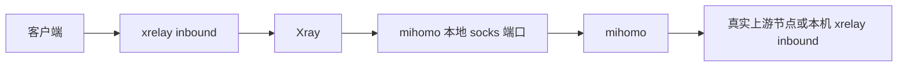

# proxystack 整体架构方案

## 1. 项目概述

`proxystack` 是一个 Python 实现的代理栈编排项目。它分为本地 `proxystack-agent` 和订阅服务 `proxystack-sub` 两个运行组件：本地 agent 使用 `/opt/proxystack/config.yaml` 保存全局配置，每个 stack 使用 `/opt/proxystack/stacks/<name>.yaml` 单独描述一组 `xrelay -> clash` 配置，自动生成并管理 Xray、mihomo 和 systemd 配置；subscription input 是 agent 和 sub 共享的输入格式，既可以由 sub 服务合并生成订阅，也可以直接给 agent 校验、合并和重新导出发布包。

## 2. 业务需求

### P0 功能

- 统一配置目录：所有本地文件默认收敛到 `/opt/proxystack`，全局配置和 stack 配置分离。
- 独立 stack 文件：每个 stack 一个 YAML 文件，里面包含该 stack 的 xrelay 和 clash 配置。
- 配置编译：从 `config.yaml + stacks/*.yaml` 生成 Xray JSON、mihomo YAML、subscription 输入索引和订阅发布包。
- 多实例管理：本地 agent 支持 `proxystack-xray@<name>.service`、`proxystack-clash@<name>.service`；sub 服务本地部署时支持 `proxystack-sub.service`，Docker 部署时由容器运行时管理。
- 下载和安装：安装/更新 mihomo、xray-core 和 geo 数据；systemd unit 由 `service install|uninstall` 管理。
- CLI 生命周期：`init`、`add`、`edit`、`list`、`remove`、`clone`、`check`、`start`、`stop`、`restart`、`status`、`logs`、`enable`、`disable`、`publish`、`doctor`，以及高级 `validate`、`render` 和 `service install|uninstall|start|stop|restart|status|log`。
- 配置生命周期：`add`、`edit`、`list`、`remove`、`clone`、`render`；`clone --allocate-ports` 可基于全局端口池重新分配监听端口。
- 订阅发布：本地基于 `xrelay.inbounds[].sub == true` 生成订阅输入/发布包；agent 和 sub 都可合并多个输入文件后输出或发布 Clash/Premium Clash/Surge 订阅。
- auto 聚合：支持 mihomo `url-test` 和 `load-balance`，P0 可通过 `--members usa1,usa2` 引用其他 xrelay 暴露的 socks5 inbound。
- 凭据配置：P0 直接在 YAML 中使用明文凭据字段，订阅 token 也直接写入配置。

### P1 功能

- mihomo REST API 代理组切换、健康检查和出口 IP 查询。
- 显式 rollback 命令，用最近一次生成快照回滚。
- 配置模板 profile：本地安全模板、远程订阅模板、auto 聚合模板。

### P2 功能

- 管理 HTTP API 或轻量 Web UI。
- 非 systemd 平台适配。
- 远端订阅服务自动拉取发布包。

### M5 功能

- 原生配置备份 `export/import` 和发布增强。P0/P1 不实现通用配置备份恢复。

## 3. 系统架构

首期采用 Python monorepo，安装后提供两个 console script：

- `proxystack-agent`：本地 CLI，负责 stack 管理、配置生成、安装更新、systemd 管理、订阅发布包导出。
- `proxystack-sub`：订阅服务 CLI，负责导入订阅输入/发布包、合并 inputs 目录并启动 FastAPI HTTP 服务；可在远端服务器本地运行，也可在 Docker 容器中运行。

```mermaid
flowchart LR
  user["用户 / CLI"] --> cli["proxystack-agent"]
  cli --> config["config.yaml + stacks/*.yaml 加载与校验"]
  config --> graph["实例依赖图"]
  graph --> genx["Xray 配置生成器"]
  graph --> genc["mihomo 配置生成器"]
  graph --> gens["订阅索引生成器"]
  genx --> xconf["runtime/generated/xray/*.json"]
  genc --> cconf["runtime/generated/clash/*.yaml"]
  gens --> sidx["runtime/generated/sub/index.json"]
  gens --> bundle["publish/sub-bundle.zip"]
  cli --> systemd["systemd 管理器"]
  systemd --> xray["proxystack-xray@name.service"]
  systemd --> mihomo["proxystack-clash@name.service"]
  bundle --> remote["proxystack-sub inputs"]
  remote --> subsvc["proxystack-sub.service"]
```

运行时链路：



## 4. 技术栈决策

- Python：项目核心是配置编排、模板生成、systemd 调用、下载和订阅服务，Python 实现速度更快，也便于复用旧脚本经验。
- Typer：实现多级 CLI，生成清晰 help 文案。
- Pydantic v2：定义 stack、生成中间模型和订阅发布包 schema，并在启动阶段 fail fast。
- ruamel.yaml：读取和写入 YAML，尽量保留用户配置可读性。
- Jinja2：渲染订阅模板和 systemd 模板；Xray/mihomo 配置优先使用结构化对象再序列化。
- FastAPI + Uvicorn：实现远端订阅 HTTP 服务。
- httpx：实现 mihomo/xray 下载、远端发布包拉取和后续 HTTP 调用。
- logging 结构化封装：输出 systemd journal 友好的日志。
- pytest：单元测试、golden tests 和 HTTP 路由测试。
- 不引入数据库：首期状态以配置文件、生成文件、manifest 和日志为准。

## 5. 模块划分

- `src/proxystack/cli`：Typer 命令入口，拆分 agent/sub 命令。
- `src/proxystack/config`：全局配置、stack 文件加载、schema 校验。
- `src/proxystack/domain`：GlobalConfig、Stack、StackSet、Inbound、Outbound、Ref、ProxyGroup 等领域模型。
- `src/proxystack/graph`：解析引用，构建实例依赖图，检测循环依赖和端口冲突。
- `src/proxystack/generator/xray`：生成 Xray JSON。
- `src/proxystack/generator/mihomo`：生成 mihomo YAML。
- `src/proxystack/generator/sub`：生成订阅索引、订阅模板数据和发布包。
- `src/proxystack/systemd`：模板安装、enable/disable/start/stop/restart/status/log。
- `src/proxystack/install`：下载 mihomo/xray/geo 数据，校验文件和安装路径。
- `src/proxystack/subserver`：FastAPI 订阅服务。
- `src/proxystack/mihomoapi`：mihomo REST API 查询和代理组切换。

## 6. 核心数据模型

- GlobalConfig：`/opt/proxystack/config.yaml`，保存目录、默认值、订阅和安装策略。
- Stack：`/opt/proxystack/stacks/<name>.yaml`，一个文件只包含一组 `xrelay -> clash`。
- StackSet：全局配置和所有 enabled stack 文件合并后的编译输入。
- XrelayInstance：Xray 运行实例，包含 inbounds 和 outbound 配置。
- ClashInstance：mihomo 运行实例，包含监听端口、proxies、proxy-groups、rules、mode。
- Inbound：Xray inbound，`name` 是本 stack 内引用和订阅生成的稳定标识。
- Outbound：Xray outbound，支持 `clash`、`socks5`、`http`、`direct`。
- Ref：跨实例引用，如 xrelay inbound 简写 `usa1.relay`。
- SubscriptionNode：由 `sub: true` 的 inbound 编译出来的订阅节点。
- SubscriptionInput：单个订阅输入文件，只包含由 xrelay inbound 编译出的订阅节点和来源元数据；agent 和 sub 共同支持该格式。
- SubscriptionBundle：本地 agent 导出的订阅发布包，可包含一个或多个 SubscriptionInput、模板版本、生成时间和签名/校验信息。
- MergedSubscriptionIndex：`proxystack-sub` 从 inputs 目录合并后的当前订阅索引。
- RenderManifest：记录本次生成的文件、hash、来源 stack 和服务映射。

## 7. 接口设计概览

CLI 是首期主要接口，HTTP 仅用于远端订阅服务。

管理 CLI：

- `proxystack-agent init`
- `proxystack-agent add <name> [--template pair|auto-url-test|load-balance] [--members usa1,usa2] [--keep-template-ports]`
- `proxystack-agent edit [name]`
- `proxystack-agent list`
- `proxystack-agent remove <name> [--purge]`
- `proxystack-agent clone <source> <target> [--allocate-ports]`
- `proxystack-agent check [name|xrelay/name|clash/name|sub]`
- `proxystack-agent start [name|xrelay/name|clash/name|sub]`
- `proxystack-agent stop [name|xrelay/name|clash/name|sub]`
- `proxystack-agent restart [name|xrelay/name|clash/name|sub]`
- `proxystack-agent status [name|xrelay/name|clash/name|sub]`
- `proxystack-agent logs [name|xrelay/name|clash/name|sub]`
- `proxystack-agent enable [name|xrelay/name|clash/name|sub]`
- `proxystack-agent disable [name|xrelay/name|clash/name|sub]`
- `proxystack-agent publish [-o sub-bundle.zip]`
- `proxystack-agent publish --input-dir ./inputs --source merged -o sub-bundle.zip`
- `proxystack-agent doctor`
- `proxystack-agent validate [-c config.yaml] [target]`
- `proxystack-agent render [model|xrelay|clash|sub] [name]`
- `proxystack-agent render sub --input-dir ./inputs`
- `proxystack-agent sub export-input --source usa1 -o usa1.yaml`
- `proxystack-agent sub validate-inputs --input-dir ./inputs`
- `proxystack-agent service install|uninstall [name]`
- `proxystack-agent service start|stop|restart|status|enable|disable|log [name]`
- `proxystack-agent install mihomo|xray|geo|all`
- `proxystack-agent update mihomo|xray|geo|all`
- `proxystack-agent update self`

远端订阅 CLI：

- `proxystack-sub import sub-bundle.zip`
- `proxystack-sub rebuild`
- `proxystack-sub serve`

订阅 HTTP：

- `GET /health`
- `GET /sub/:user`
- `GET /premium_sub/:user`
- `GET /surge_sub/:user`

## 8. 非功能性设计

- 安全默认值：默认不生成公开 socks/http inbound；用户显式配置时必须考虑鉴权。
- Fail fast：端口冲突、引用缺失和循环依赖都应在 `validate` 阶段暴露。
- 可观测性：所有命令使用结构化日志，服务状态通过 systemd 和 manifest 查询。
- 幂等性：`start` 多次执行结果一致；生成文件带 hash，未变化不写入。配置变化时重启受影响服务，并启动目标范围内未变化的服务。
- 可恢复：P0 保留最近一次生成的 manifest 和上一版生成文件快照，但不提供显式 rollback 命令；显式 rollback 放到 P1，原生备份 `export/import` 推迟到 M5。
- 远端最小数据：`proxystack-sub` 只保存订阅输入/发布包和合并索引，不保存完整 stack、clash upstream、rules 或 mihomo controller 配置。
- 同机隔离：agent 和本地 sub 可以共用 `/opt/proxystack` 根目录，但写入目录和锁文件必须分离；agent 可写 `runtime/`、`publish/`、`downloads/` 和 `stacks/`，sub 只写 `sub/inputs/`、`sub/bundles/`、`sub/current/`。agent 运行期不写 `config.yaml`，只有 `init` 和 `edit` 这类配置管理命令可以写 `config.yaml`。
- 权限边界：默认使用 `proxystack:proxystack` 用户和用户组，`/opt/proxystack` 为 `0750`；代理核心安装到 `/opt/proxystack/bin`，geo 数据安装到 `/opt/proxystack/geo`，二者默认 owner 为 `proxystack:proxystack`。
- 锁语义：agent 生成和服务管理使用 agent 锁，sub import/rebuild 使用 sub 锁；锁文件互不复用，避免同机部署时互相阻塞或覆盖。

## 9. 部署方案

默认部署在 Linux + systemd：

- Python 虚拟环境：`/opt/proxystack/.venv`
- CLI：`/usr/local/bin/proxystack-agent`、`/usr/local/bin/proxystack-sub`，并提供短别名 `/usr/local/bin/ps-agent`、`/usr/local/bin/ps-sub`
- 代理核心二进制：`/opt/proxystack/bin/mihomo`、`/opt/proxystack/bin/xray`
- geo 数据：`/opt/proxystack/geo/`
- 全局配置：`/opt/proxystack/config.yaml`
- stack 配置：`/opt/proxystack/stacks/*.yaml`
- 运行时：`/opt/proxystack/runtime/`
- 生成文件：`/opt/proxystack/runtime/generated/`
- 订阅发布包：`/opt/proxystack/publish/sub-bundle.zip`
- 下载缓存：`/opt/proxystack/downloads/`
- 本地订阅服务数据：`/opt/proxystack/sub/`
- 日志：systemd journal
- systemd 模板：
  - `/etc/systemd/system/proxystack-xray@.service`
  - `/etc/systemd/system/proxystack-clash@.service`
  - `/etc/systemd/system/proxystack-sub.service`

订阅服务本地部署：

- Python 虚拟环境：`/opt/proxystack/.venv`
- 发布包目录：`/opt/proxystack/sub/bundles/`
- 输入目录：`/opt/proxystack/sub/inputs/`
- 当前订阅索引：`/opt/proxystack/sub/current/index.json`
- systemd 服务：`/etc/systemd/system/proxystack-sub.service`

订阅服务 Docker 部署：

- 镜像：`proxystack-sub:<version>`
- 数据卷：`/opt/proxystack/sub:/data`
- 容器命令：`proxystack-sub serve --host 0.0.0.0 --port 3003 --data-dir /data`
- 发布包导入：`docker cp sub-bundle.zip` 后执行 `docker exec proxystack-sub proxystack-sub import /tmp/sub-bundle.zip --data-dir /data`
- 多输入合并：挂载或导入多个文件到 `/data/inputs/` 后执行 `proxystack-sub rebuild --data-dir /data`
- 安全运行：Docker 镜像默认文档使用非 root 用户、只读根文件系统、`cap_drop: ALL` 和持久化 `/data` volume。

## 10. 任务分解

首期任务见 [PROGRESS.md](PROGRESS.md) 和 [tasks](tasks) 目录。建议按以下顺序实现：

1. 领域模型和 stack schema。
2. 配置加载、校验和引用图。
3. Xray/mihomo/subscription 生成器。
4. CLI 配置生命周期。
5. 安装下载器。
6. systemd 服务管理。
7. 订阅发布包和远端 HTTP 服务。
8. mihomo API 辅助能力。
9. 测试矩阵、打包和发布。

## 11. 风险登记

| 风险 | 影响 | 应对 |
| --- | --- | --- |
| 本机端口很多，冲突不易发现 | 服务启动失败或流量走错实例 | `validate` 必须全局扫描所有 listen 端口 |
| 自动分配端口不稳定 | clone 后配置难以追踪 | `add` 默认使用全局 `port_ranges` 避免模板端口冲突；`clone` 只在用户显式传入 `--allocate-ports` 时重新分配端口，并把结果写回 stack 文件 |
| auto 引用其他 xrelay inbound 导致循环 | mihomo 和 xray 互相等待 | 依赖图检测循环，禁止运行时循环引用 |
| socks/http 暴露不安全 | 未授权访问代理 | 默认禁用公开 socks/http；非回环监听要求 auth 或显式危险确认 |
| mihomo/xray 配置格式变化 | 生成文件不可用 | 生成器集中封装，使用 golden tests 覆盖 |
| 订阅与实际 Xray inbound 不一致 | 客户端连接失败 | 订阅索引从同一份编译后模型生成，不读取手写副本 |
| 远端订阅服务拿到过多内部信息 | 暴露 upstream、rules 或 controller 配置 | 订阅输入/发布包只包含订阅节点、客户端连接凭据和模板元数据，不包含完整 stack 或 clash 内部信息 |
| 订阅 URL 被未授权访问 | 客户端节点泄露 | 默认建议启用 token 访问控制，`none` 只用于本地或显式风险确认 |
| Docker 部署丢失订阅数据 | 容器重建后订阅为空 | 必须挂载持久化 `/data` volume，导入发布包后原子切换 current |
| 多输入合并出现重复节点 | 客户端订阅出现重复或覆盖不可预期 | 以稳定 node id 去重，并在 rebuild 输出冲突报告 |
| agent 和本地 sub 同机部署误写同一目录 | 订阅 current 被覆盖或运行状态互相污染 | agent/sub 写入目录和锁文件分离，发布包必须经 import/rebuild 才进入 sub/current |

## 12. 领域术语表

- xrelay：本项目中 Xray 实例的逻辑名称，负责向客户端暴露 inbound。
- clash：本项目中 mihomo 实例的逻辑名称，负责上游选择、规则和聚合。
- config.yaml：全局配置文件，保存目录、默认值、订阅和安装策略。
- stack：一个独立配置文件，如 `stacks/usa1.yaml`，包含一组 xrelay 和 clash 配置。
- stack set：`config.yaml + stacks/*.yaml` 合并后的编译输入。
- inbound：Xray 对客户端开放的监听入口。
- outbound：Xray 向上游发起连接的出口。
- ref：跨实例引用字符串。
- sub：是否进入订阅输出的唯一开关。
- auto：使用本机多个 xrelay socks5 inbound 作为 mihomo 下游节点，再由 `url-test` 或 `load-balance` 自动选择。
- subscription input：一个可被 `proxystack-sub` 合并的订阅输入文件，通常来自某个 agent 或某组 stack。
- subscription bundle：本地 agent 生成、sub 服务导入的订阅发布包，可携带一个或多个 subscription input。

## 13. 架构决策记录

### ADR-001 使用全局 config.yaml 加独立 stack 文件

背景：旧方案中 clash 监听端口和 xrelay outbound 指向端口需要分别配置，新增实例对时容易重复劳动。

决定：以 `/opt/proxystack/config.yaml` 保存全局配置，以 `/opt/proxystack/stacks/<name>.yaml` 保存每个 stack 的 xrelay 和 clash 配置。生成器负责合并全局配置与所有 enabled stack 后输出各组件配置。

后果：实现中必须提供跨文件引用校验、端口冲突检查、清晰 plan 输出和 P0 回滚所需快照；显式 rollback 命令放到 P1，原生备份导入导出放到 M5。

### ADR-002 不重写代理核心

背景：mihomo 和 xray-core 已经稳定实现代理协议、规则、测速和负载均衡。

决定：proxystack 只做编排、配置生成、安装和服务管理，不实现代理协议核心。

后果：项目复杂度集中在配置模型、引用解析和运行时管理，升级风险来自外部二进制兼容性。

### ADR-003 只保留 `sub`

背景：订阅暴露如果拆成多个开关，会让配置含义重复且容易冲突。

决定：订阅是否输出只由 `inbounds[].sub` 决定。

后果：订阅生成逻辑简单，但 schema 必须对 socks/http 的 auth 和公开监听做安全校验。

### ADR-004 默认 mihomo mode 使用 Rule

背景：多实例场景下既需要国内直连和私网直连，也需要最终代理组可控。

决定：生成的 mihomo 配置默认 `mode: Rule`。`Global` 和 `Direct` 作为显式配置保留。

后果：必须内置一套默认 rules profile，并允许用户追加自定义规则。

### ADR-005 Python 双组件架构

背景：项目使用场景分为本地运行 stack 对提供网络服务，以及远端服务器运行订阅服务。

决定：使用 Python 实现 `proxystack-agent` 和 `proxystack-sub` 两个组件。本地 agent 管理 `/opt/proxystack/config.yaml`、`/opt/proxystack/stacks/*.yaml` 和运行时配置，sub 服务只消费订阅输入/发布包，并支持像 `clashsub` 的 `inputs` 目录一样合并多个输入文件。

后果：部署需要管理 Python 虚拟环境和依赖锁定，但开发效率、脚本化运维和订阅服务拆分会更直接。

### ADR-006 Shell 只做首次 bootstrap

背景：首次安装需要创建系统用户、目录、Python venv 和 CLI 链接，这些步骤天然依赖操作系统环境；而后续更新需要版本校验、manifest、服务状态恢复和回滚。

决定：Shell 部署脚本只负责首次 bootstrap。proxystack 代码更新通过 `proxystack-agent update self` 管理；mihomo、xray-core 和 geo 数据通过 `proxystack-agent install/update mihomo|xray|geo|all` 管理。代理核心固定安装在 `/opt/proxystack/bin` 或用户显式配置的等价路径，geo 数据固定安装在 `/opt/proxystack/geo` 或等价路径。

后果：部署脚本保持简单可审计；重复运维动作统一进入 Python 代码，便于做校验、锁、日志、回滚和测试。`update self` 默认由 `proxystack` 用户写 `.venv`，systemd unit 安装卸载才需要 root 权限。
